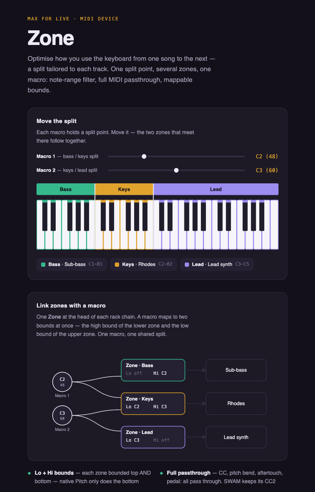

# Zone — a Max for Live keyboard split / zone filter

Zone is a tiny **Max for Live MIDI Effect** that passes only the notes inside a key range
and lets everything else through untouched. It simply lets you optimise how you use the
keyboard from one song to the next — a split tailored to each track.

**▶ [Interactive demo](https://claude.ai/code/artifact/1a33057b-34ec-4ba8-b8df-364b2746d822)** — move a macro, watch one split point drive several zones.



## What it does

- **Two independent, toggleable bounds** — `Lo` passes notes `≥` its value, `Hi` passes
  notes `<` its value (the pivot note belongs to the upper zone). Turn one off for an
  open-ended range, both off to pass everything.
- **Full MIDI passthrough** — control change (expression, sustain, breath…), pitch bend,
  aftertouch, program and poly pressure all pass unchanged, so breath/expression-driven
  instruments keep working.
- **Macro-mappable** — both bounds are Live parameters. Put one Zone at the head of each
  Instrument Rack chain and drive every split point from a single Rack macro. Instances
  stay independent yet synchronizable — the sync lives in Ableton, not the device.
- **Learn** — click a Learn button and play a note to set a bound, or click the on-screen
  piano.
- **No stuck notes** — a held note always gets its note-off, even if you move or disable a
  bound while it rings.

Stack as many instances as you like to build arbitrary multi-zone keyboard splits.

## Files

| File | Purpose |
|---|---|
| `zone.js` | The brain — note filtering + passthrough logic |
| `zone.maxpat` | The Max patch (UI + wiring) |
| `gen_zone_maxpat.py` | Regenerates `zone.maxpat` |
| `zone-demo.html` | Self-contained interactive demo |

## Build the device (`.amxd`)

The repo ships the source (`zone.maxpat` + `zone.js`); build the frozen device once:

1. In Live, add an empty **Max MIDI Effect** to a track.
2. Click **Edit** → Max opens.
3. **File → Open** `zone.maxpat`, select all (⌘A), copy (⌘C).
4. Back on the empty device window: ⌘A → delete → paste (⌘V).
5. Save the device **in this folder** (so `js zone.js` resolves), then **Freeze** (embeds
   `zone.js`) → save as `Zone.amxd`.

## Signal flow

```
midiin → midiparse ─ notes ──→ [js zone.js] ──→ midiout   (filtered notes)
                    └ everything else → midiformat → midiout   (untouched passthrough)
```

## License

MIT — see [LICENSE](LICENSE).
