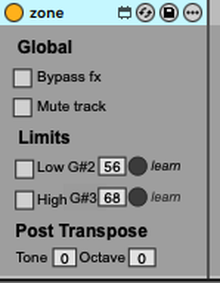
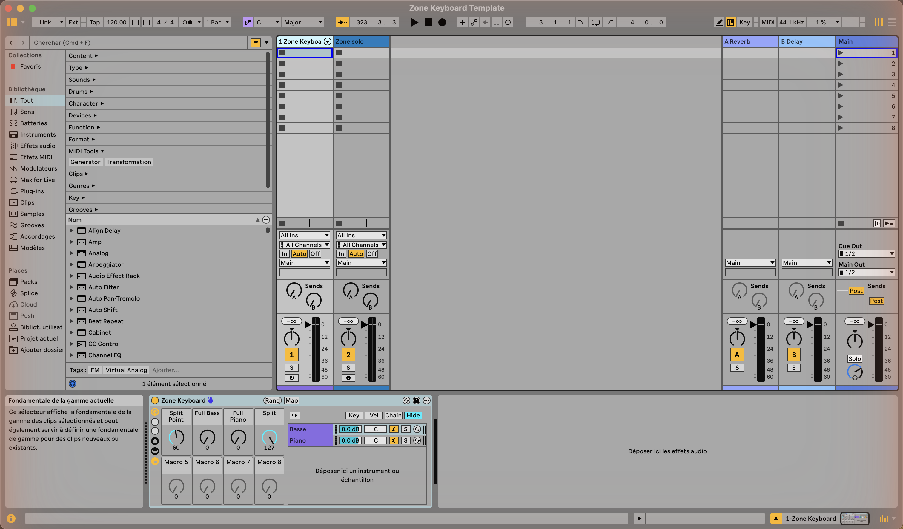

# Zone — keyboard split / zone filter for Ableton Live



One tiny **Max for Live MIDI effect** per instrument: it plays only the keys you give it.
Set a low and a high bound, shift the result by octaves or semitones, and build
hardware-style **splits and layers** — one rack macro can move a split point across
several instruments at once.

## Get it

1. Download **[`zone.amxd`](https://github.com/Beennnn/zone-m4l/raw/main/zone.amxd)**
   (also listed on [maxforlive.com](https://www.maxforlive.com/library/device.php?id=15717)).
2. Drop it on a **MIDI track, before the instrument** (or into a rack chain).
3. Requires Live with Max for Live (Suite, or Standard + M4L). Built on Live 12 / Max 8.6.

## Using it — 60 seconds

| Row | Controls | What they do |
|---|---|---|
| **Global** | `Bypass` · `Mute` | Bypass = no limits (everything through) · Mute = empty zone (nothing through) |
| **Limits** | `Low` · `High` | the zone: notes ≥ Low and < High pass — the High note itself belongs to the *upper* zone |
| **Post transpose** | `Oct` · `Tone` | shift the surviving notes, ±4 octaves (coarse) + ±12 semitones (fine), **after** the filter |

The keyboard at the bottom is driven by the mode tabs:

- **Edit Low / Edit High** — click the keyboard *or simply play a note* to set that bound
  (editing **is** the learn). Colour code: Low = teal, High = violet.
- **Watch In / Watch Out** — the keyboard lights the incoming vs outgoing note
  (blue / amber) so you can see the filter and transpose at work.
- **◀ ▶** — scroll the 61-key view by octave across the full MIDI range.

Everything that isn't a note passes through untouched — sustain, expression and any CC,
pitch bend, aftertouch, program change. Held notes always get their note-off, even if you
move a bound, transpose, mute or bypass while they ring: no stuck notes.

## Splits & layers — the point of it all

Every control is a Live parameter: automatable, MIDI-mappable and **rack-macro-mappable**.
Put one Zone at the head of each Instrument Rack chain and map the bounds to macros —
the instances stay independent, the *sync* lives in the rack:

| Stage-keyboard mode | With Zones |
|---|---|
| **Solo** (one sound everywhere) | one chain, limits off |
| **Split** (bass left / keys right) | chain A `High` + chain B `Low` on **one macro** = movable split point |
| **Layer** (two sounds together) | both chains full range (or both bypassed) |
| **Split + layer** | any mix — stack as many Zones as you like |

**→ [`rack/`](rack/) ships a ready-made "Zone Keyboard" rack** (`.adg` + demo Live set):
Basse + Piano chains with `Split Point`, `Full Bass`, `Full Piano` and `Split` (turn it
down for layer mode) macros, ready to fill with your own instruments.

[](rack/)

## Try it in the browser

**[Interactive demo](https://claude.ai/code/artifact/1a33057b-34ec-4ba8-b8df-364b2746d822)**
(or open [`zone-demo.html`](zone-demo.html) locally) — move a macro, watch one split
point drive several zones.

---

## Under the hood

| File | Purpose |
|---|---|
| [`zone.amxd`](zone.amxd) | the device, ready to use |
| [`zone.js`](zone.js) | the brain — filtering, transpose, note tracking, keyboard display |
| [`zone.maxpat`](zone.maxpat) | the Max patch (UI + wiring) |
| [`gen_zone_maxpat.py`](gen_zone_maxpat.py) | regenerates `zone.maxpat` from code |
| [`rack/`](rack/) | Zone Keyboard rack preset + demo set + docs |

```
midiin → midiparse ─ notes ───→ [js zone.js] ───→ midiout   (filtered + shifted notes)
                    └ everything else → midiformat → midiout   (untouched passthrough)
```

Hacking notes:

- `zone.js` is **referenced, not frozen** in the device, and runs with `autowatch = 1`:
  edit the file next to the device and Max hot-reloads it.
- The UI is generated: edit `gen_zone_maxpat.py`, run it, and swap the patcher JSON
  straight into `zone.amxd` (the `.amxd` is a 32-byte `ampf` header + the patcher JSON —
  see the commit history for the exact recipe).
- The kslider echoes back every note you send it for display; `zone.js` guards all
  programmatic sends with an `echo` flag. Remove it and you get a stack overflow.

Latest version, changelog and issues live here on GitHub — the maxforlive page is a
pointer to this repo.

## License

MIT — see [LICENSE](LICENSE).
